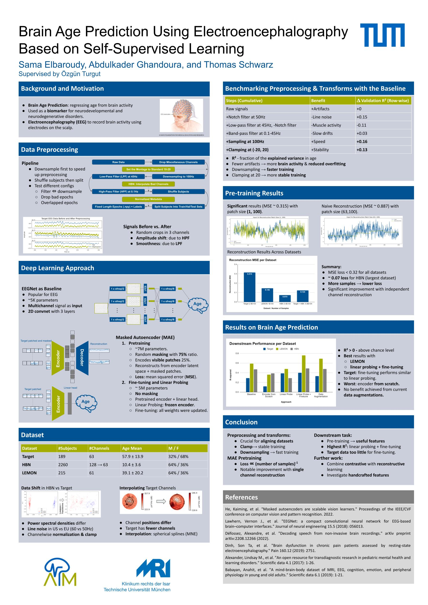

# Brain Age Prediction Using Electroencephalography (EEG) Based on Self-Supervised Learning

TUM Praktikum: Applied Deep Learning in Medicine

Contributors: Sama Elbaroudy, Abdulkader Ghandoura and Thomas Schwarz

Supervised by Özgün Turgut

## Poster



## Introduction 
**Brain Age Prediction** is a regression method to estimate one's brain age. This brain age can be used as a biomarker for neurodevelopmental and neurodegenerative disorders.
<!-- It can be used to find relationships between brain aging and various health outcomes -->
**EEG** is a  direct measurement of brain activity using electrodes placed on the scalp. It has a high temporal resolution but limited spatial resolution.

In our project, we used resting-state EEG to predict brain age, and our contributions are: 
- A study on the effect of preprocessing and transforms.
- Brain age prediction using a self-supervised learning (SSL) approach utilizing a masked autoencoder (MAE; Kaiming et al., 2022).
- Comparison of SSL performance to a supervised baseline EEGNet (Lawhern et al., 2018).
- Methods were applied on three datasets 
    - Target Dataset (Dinh et al., 2019)
    - HBN Dataset (Alexander et al., 2017)
    - LEMON Dataset (Babayan et al., 2019)
## Key Findings 

### Preprocessing and Transforms on Baseline
- Fewer artifacts → more brain activity &  reduced overfitting.
- Downsampling → to faster training.
- Clamping at 20 → stable training for baseline (also see Defosséz et al, 2022). 
### Pretraining
- Patch size of 1 in EEG channel space → significant reconstruction. 
- More samples &uarr;  &rarr; lower MSE loss &darr;
### Age Regression
| Dataset (r2)|Baseline|Encoder from Scratch|Linear Probe|Linear Probe + Finetune|Data Augmentation|
|-------------|----------|---------------|--------------|-------------------------|-----------|
|Target|0.29|0.12|0.39|**0.4**|0.33|
|LEMON|0.59|0.36|0.48|**0.76**|0.69|
|HBN|0.47|0.39|0.29|**0.49**|0.48|

* Training the vision transformer from scratch yields the worst performance. Here, the large number of parameters causes the ViT to overfit.
* For all experiments, training on lemon gives the best results. 
* Our data augmentations did not add to performance.
* For all runs, linear probing followed by finetuning performed the best.
* For the target, there is a negligible benefit of finetuning after linear probing. This may be due to the  small size of the target dataset that leads to overfitting in finetuning but not linear probing.


## To Reproduce Results 
Results can be reproduced by following these steps:
1. Setting up the Environment
2. Downloading the Datasets
3. Setting up the data directory
4. Organizing Metadata
5. Data Preprocessing
6. Training the Baseline 
7. SSL Approach 
    a. Pretraining MAE 
    b. Linear Probing and Finetuning
### Setting up the Environment

1. Create and activate conda environment 
```
conda create --name brain-age 
conda activate brain-age 
```
2. Install the requirements 
```
pip install -r requiremnets.txt 
```
3. Finally,  a hack in order to make `timm==0.3.2`  work with latest `torch`. First, run 
```
python -m site
```
You will see a list of paths. Among them, copy the path that ends with `.../lib/python3.11/site-packages` then 
```
cd <copied_path>` 
cd timm/models/layers 
```
Open `helpers.py` and add the following code to the top of the file 
```
import torch
TORCH_MAJOR = int(torch.__version__.split('.')[0])
TORCH_MINOR = int(torch.__version__.split('.')[1])

if TORCH_MAJOR == 1 and TORCH_MINOR < 8:
    from torch._six import container_abcs
else:
    import collections.abc as container_abcs
```
Finally, comment this line: `torch._six import container_abcs `

### Downloading the Datasets
The HBN and LEMON data can be downloaded as follows:
```
python src/utils/download_lemon.py --dest path/to/lemon/raw
```
```
python src/utils/download_hbn.py --dest path/to/hbn/raw
```
To download the target dataset (BAP):
```
wget -P path/to/bap/raw "https://files.osf.io/v1/resources/hbkms/providers/osfstorage/5df8d6254263ab000ac0bbdf/?zip="

```
Please note that the HBN dataset comprises ~5TB of recording files, so make sure you have sufficient disk capacity. The HBN recording files of the resting state can be extracted from the downloaded data with:
```
python extract_eeg_hbn.py --src path/to/raw_hbn --dest path/to/hbn/unzipped --type rest
```

### Setting up the data directory

Finally, we assume the following data directory structure:
```
   data                     // data directory
   |-hbn                    // healthy brain dataset
   |    |-raw               // downloaded files
   |    |-hbn-metadata.csv	
   |    |-hbn-metadata
   |    |-unzipped         // output of extract_eeg_hbn.py
   |    |-preprocessed     // output of src/preprocessing/preprocessing.py
   |        |-v1.0         // dataset version
   |-bap // target dataset
   |    |-bap-metadata.csv
   |    |-raw             // downloaded files
   |    |-preprocessed
   |        |-v1.0
   |    |-bap-channel-names.txt
   |-lemon                // LEMON dataset
       |-LEMON_RAW        // downloaded files
       |-Behavioural_Data_MPILMBB_LEMON // downloaded metadata
       |-name_match.csv   // mapping from initial to new subject names
       |-preprocessed     // output of src/preprocessing/preprocessing.py
           |-v1.0
       |-lemon-metadata.csv
```

### Organizing Metadata

The dataset-metadata.csv files contain the Subject ID, Age, and Sex columns. To create these files for the three datasets mentioned above, you first need to ensure that the corresponding original metadata for each of them is placed as follows:

**Target** metadata input file path: `path/to/data/bap/raw/clinical_data_updated_xxxx-xx-xx.ods`

**HBN** metadata input directory: `path/to/data/hbn/hbn-metadata/`

**LEMON** metadata input directory: `path/to/data/lemon/Behavioural_Data_MPILMBB_LEMON`

Afterwards, change your directory to `src/utils`, then run the command:

```
python organize_metadata.py --datasets_path /path/to/data/ 
```

You can also create the metadata files for specific datasets as follows:

```
python organize_metadata.py --datasets_path /path/to/data/ --dataset_names bap lemon
```

The organized metadata will be saved in `path/to/data/<dataset>/<dataset>-metadata.csv`

<!-- ## Data Visualization -->
### Data Preprocessing 

To run the preprocessing script, do the following steps:


Change your directory to `src/preprocessing`, then start your command with:

```
python preprocessing.py
```

Continue by sending the following command-line arguments:

* The `path/to/data` directory, datasets you want to use, and preprocessing version

```
--datasets_path /path/to/data/ --dataset_names bap lemon hbn --d_version v1.0
```

* The low-pass filter, high-pass filter, and sampling frequency

```
--filter lpf 45 --filter hpf 0.1 --sfreq 100
```

* The train, validation, and test splits for each of the datasets you want to use

```
--split bap 70 15 15 --split lemon 70 15 15 --split hbn 60 20 20
```

### Training The Baseline 

To run the baseline script, do the following steps:

Change your directory to `src/models`, then start your command with:

```
python baseline_eegnet_regression.py 
```
Continue by sending the following command-line arguments:

* The `path/to/data` directory, dataset name, and version of preprocessed data

```
--datasets_path /path/to/data/ --dataset_name bap --d_version v1.0
```

* The experiment name and number of electrodes

```
--experiment_name bap_baseline --num_electrodes 63
```

### Self-supervised Approach 
#### Pretraining
Pretraining can be done using `train.py` file which initializes `MaskedAutoencoderViT` from `mae.py`

The directory that contains all the datasets and the version of the preprocessed data will need to be sent in the command-line 
*we did experiments on different preprocessing versions and named them v1.0, v2.0, ...*
This is applied on all pre-training command lines
```
python train.py --datasets_path /path/to/data --dataset_version v2.0
```
Commmand-line arguments can be used to change some training configurations, such as batch size, number of epochs, learning rate, .. 
```
python train.py --batch_size 128 --epochs 400 --lr_mae 2.5e-4
```
To pretrain on different dataset, for instance LEMON dataset, a command-line argument `--mae_train_dataset lemon` should be used, don't forget to set the number of channels in `num_channels` argument, because LEMON had 61 channels compared to HBN and bap dataset had 63. 
```
python train.py --mae_train_dataset lemon --mae_val_dataset lemon --num_channels 61
```
A pre-training on multiple datasets can also be done, for instance:
```
python train.py --mae_train_dataset bap hbn --mae_val_dataset bap 
```

Also, for testing pretraining at early stages, online linear probing was implemented by setting `--mae_age` to `True` and specifying the dataset to train the linear head and its learning rate. In this case, `train.py` will initialize `MAE_AGE` from `mae_age_regressor.py` which is a wrapper for `MAE` + `age regressor`

```
python train.py --mae_age True --lr_regressor 1e-3 --regressor_train_dataset bap
```

##### Linear Probing and Finetuning


To finetune, inside`src/models` run the`finetune.py` script. This script takes similar parameters as `train.py`, including the model parameters (these need to be consistent for model loading), dataset parameters (e.g. `num_channels`) and training parameters.

To finetune a model on a dataset (e.g. `bap`), with a pretrained model saved on wandb(e.g. id `68ww7y5i:best`), run:

```
python finetune.py --dataset bap --artifact_id 68ww7y5i:best 
```

By default, this command performs first a linear probing and then finetunes the encoder, reusing the head from the linear probing run. 

Instead of finetuning the entire encoder, you can also finetune just the last layer of the encoder (+linear head): 

```
python finetune.py --dataset bap --artifact_id 68ww7y5i:best --mode linear_probe finetune_last_layer
```

To train the encoder from scratch, as a control, you can set the mode: 

```
python finetune.py --dataset bap --artifact_id 68ww7y5i:best --mode random_initialization --lr 1e-4  --epochs 100
```

You can set the learning rate and number of epochs to train for each mode like this:

```
python finetune.py --dataset bap --artifact_id 68ww7y5i:best --epochs 100 60 --mode linear_probe finetune_encoder --lr 1e-2 1e-4
```
## References 
1. Papers
- He, Kaiming, et al. "Masked autoencoders are scalable vision learners." Proceedings of the IEEE/CVF conference on computer vision and pattern recognition. 2022.
- Lawhern, Vernon J., et al. "EEGNet: a compact convolutional neural network for EEG-based brain–computer interfaces." Journal of neural engineering 15.5 (2018): 056013.
- Défossez, Alexandre, et al. "Decoding speech from non-invasive brain recordings." arXiv preprint arXiv:2208.12266 (2022).
2. Data Source
- Target Dataset: Dinh, Son Ta, et al. "Brain dysfunction in chronic pain patients assessed by resting-state electroencephalography." Pain 160.12 (2019): 2751.
- Healthy Brain Dataset: Alexander, Lindsay M., et al. "An open resource for transdiagnostic research in pediatric mental health and learning disorders." Scientific data 4.1 (2017): 1-26.
- LEMON: Babayan, Anahit, et al. "A mind-brain-body dataset of MRI, EEG, cognition, emotion, and peripheral physiology in young and old adults." Scientific data 6.1 (2019): 1-21.
3. Source Code
- MAE implementation: https://github.com/facebookresearch/mae
- Torcheeg library: https://torcheeg.readthedocs.io/en/latest/
- MNE library: https://mne.tools/stable/index.html 
